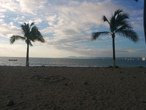
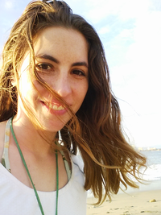
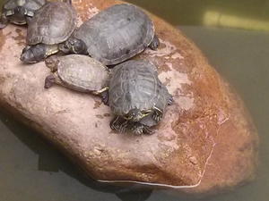

# Lauren & Ronn's Wedding

## Puerto Vallarta, MX

## 2015-02-12 to 2015-02-17

Lauren made math-y nametags to seat people after the wedding.

And the pool at the villas was gorgeous.

We wandered around the Zona Romantica area on the first day. Here's a view of that central area.

<iframe src="romantica.html" frameborder="0" height="300px" width="500px"></iframe>

Some beach pics from the Zona Romantica that day, selfies and tourist pics.

Here are some paintings I want to copy.

We saw the "Voladores de Papantla".

Danny filmed them from the ground.

Our hotel was really nice! They didn't have our reservation at first, and our first room didn't get wifi service and our second room had a broken stove. But there was lots of greenery and food and animals and everyone was really nice.

<!-- vines and balconies -->

<!-- pool -->

<!-- breakfast -->

<!-- more balconies -->
<!--  -->
<!-- room -->

<!-- turtles -->

<!-- 
 -->

<!--
convert greenery.jpg greenery.png
convert greenery.png -resize 300 greenery_small.png
-->

We went to a beach that the people at the bar told us about. The stairs were gated with a sign saying "closed" or something. So we asked someone nearby how to get to the beach. They pointed out that you could just walk *around* the gate. So we did that.

<!--  -->

<!--  -->