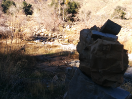

# Sespe Hot Springs

## 2014-12-22 to 2014-12-26

We walked at least 34 miles. We crossed a bunch of rivers.

We stayed at the coolest campsite ever! (you can drag the photo below to look around)

<iframe src="campsite.html" frameborder="0" height="300px" width="500px"></iframe>

When we first got there, Erin put up lights and Danny slept. In the morning, Erin slept.

Here are a couple videos one of the hot pools.

<video src="hot-pool1.mp4" controls poster="poster_small.png" width="500"></video>
<video src="hot-pool2.mp4" controls poster="poster_small.png" width="500"></video>

Danny discovered the source while Erin was sleeping. It's the hottest hot springs in California.

<video src="source.mp4" controls poster="poster_small.png" width="500"></video>

We cooked food in the source. There was a lot of steam.

We met a new friend!!

We saw some paintings. And a *hot* waterfall.

Someone laid out some rocks in an interesting way...

<iframe src="rocks.html" frameborder="0" height="300px" width="500px"></iframe>

Danny also discovered a fun place where cold water becomes hot.

<video src="cold-to-hot.mp4" controls poster="poster_small.png" width="500"></video>

And sheep. Or rams. Or something...

<video src="rams.mp4" controls poster="poster_small.png" width="500"></video>

I braided my hair so it would stay relatively clean. Afterwards, it was pretty poofy.

Here are some more photos of scenery.

Here are some more photos of us.

