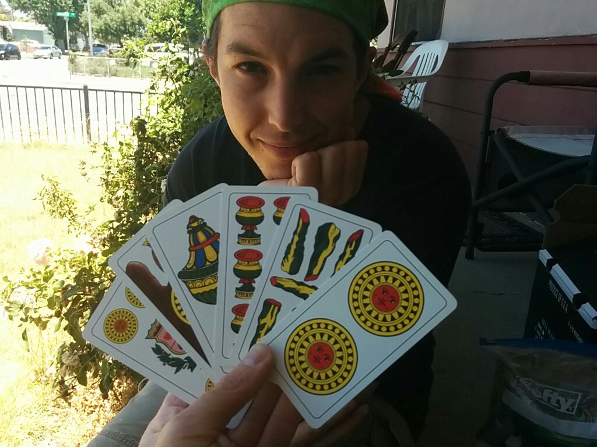

## How to Play Scopone (Scientifico) ##

### Game Play ###

 0. Dealer shuffles and deals out all the cards to four players. Players sitting accross from each other are on the same team.
 0. Players take turns playing one card each in a clockwise direction.
 0. Players take cards by adding up the values of some subset of cards on the table and matching that with the value of the card they play. Aces clear the table.
 0. Players get a scopa when they clear the board with any card other than an ace.
 0. The remaining cards on the table (if any) go to the last team to pick up cards.
 0. Points are tallied for this round. (see points)
 0. Teams play up to 15 points.

### Points ###

* Each scopa is worth 1 point.
* The team with the most cards (if not a draw) gets 1 point.
* The team with the most 7s (if not a draw) gets 1 point.
* The team with the most coin cards (if not a draw) gets 1 point.
* The 7 of coins is worth 1 point.
* The king of coins is worth 1 point.
* Napoli points: If any team gets all three of the 1, 2, and 3 of coins, then they get 3 points for this. Otherwise no Napoli points are awarded. If Napoli points are awarded, any streak from 1 to N of coins cards is worth N points.
<!-- Napoli points: for N>=3, if a team gets a streak from 1 to N of coins, then they get N points. If N<3, no Napoli points are awarded.-->